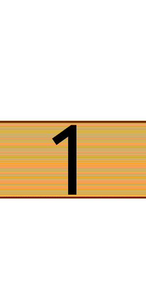
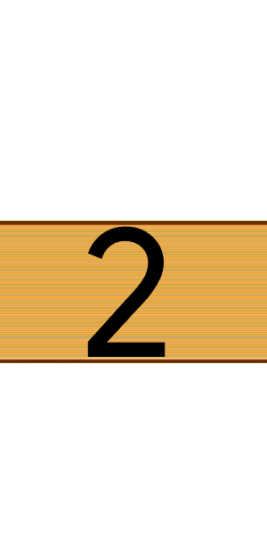
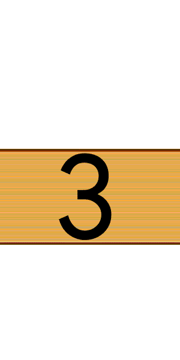
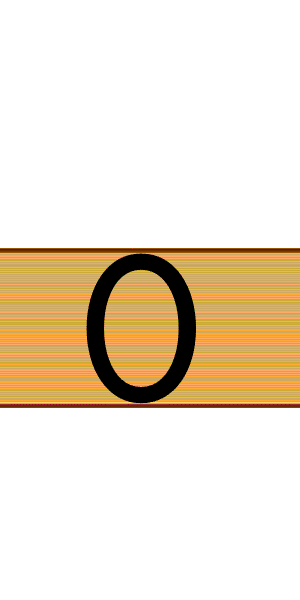

# Nizi-Counter
伊地知ニジカのアクセスカウンター

## サンプルコード

```html
<count-db
  db="you-count.k0ns10.workers.dev"
  domain="114514.cn"
  img="./"
  img-type="webp"
  left
  right
></count-db>
```
この独自タグを使用。
- `db="count.example.com"`によってデータベース選択。こちらのCloudflare Worker用の[データベースシステム](https://github.com/ams-www/YouCount)を推奨。
- `domain="example.com"`にあなたのカウント対象のサイト名を入力してください。
- `img=""`に画像のディレクトリを配置してください。相対リンク対応。
- `img-type`に拡張子を正しく入力してください。
- `left` `right`を追加することで尻尾と頭を追加。



